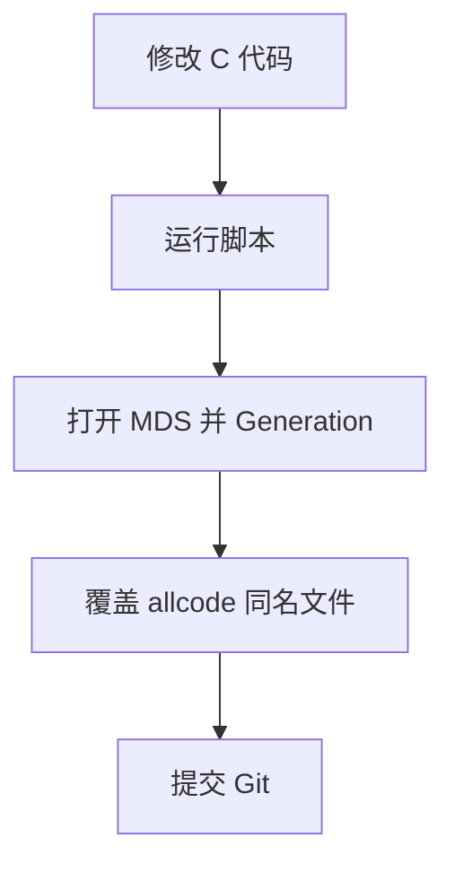

# 2026/3/2

### 添加一个离散型sensor

在服务器上改C代码，然后运行脚本（脚本中做以下事情：清空之前的prj文件，把现在的C代码由ami-tool翻译成ami能识别的语言），打开MDS，按照操作手册配置MDS，复制sensor，点击generation，把generation得到的代码文件（在workspace文件夹里），替换掉allcode里的同名文件，因为MDS修改的代码不会同步到git仓库里。



### ami-tool的脚本文件

MDS会生成一些root级文件，清理的时候需要sudo命令。

创建工程文件夹时，所有权一般设置成用户级，这样清理的时候不会频繁使用sudo 命令。

sudo运行脚本，则脚本里的每个命令都sudo运行。

脚本里不要用~，建议用绝对路径。因为在sudo下，~ 会变成 /root。

bash xxx会额外开启一个子进程，不保留环境。.xxx会在当下进程运行脚本，保留环境。

\* 不包含 .git .xxx 等隐藏文件。

# 2026/3/10

## PSU5_Status 添加失败问题总结

### 目标

新增一个离散型传感器 `PSU5_Status`，并在 Web UI 上正常显示。

### 最初做法

一开始的想法比较直接：
 参考已有的 `PSU4_Status`，复制一份并修改下标，认为这样就可以完成新增。

------

## 现象与排查过程

### 1. 初次尝试看起来成功，但结果不稳定

最开始添加 `PSU5_Status` 后，Web UI 上一度能显示。
 但随后再新增一个温度传感器后，温度传感器可以正常显示，而之前新增的 `PSU5_Status` 却消失了。

这导致一开始误以为问题和 Web UI 显示逻辑有关。

### 2. 其它类型传感器添加正常

后来又成功添加了一个功耗传感器，这进一步说明：

- 整体的传感器添加流程不是完全有问题
- 问题更可能集中在 `PSU5_Status` 这一类离散型 PSU 传感器本身

### 3. 重新验证后发现并不是 Web UI 本身的问题

重新开了一个分支，只单独添加 `PSU5_Status`，结果 Web UI 仍然显示失败。
 同时用 `ipmitool sensor list` 查看时，可以看到 `PSU5_Status` 已经存在。

这说明：

- 传感器对象本身已经被系统识别到了
- 问题不在“有没有加进去”
- 而在于它后续状态异常，导致 Web UI 没有正常显示

------

## 根本原因

问题本质上不是单纯“少复制了几处代码”，而是 **PSU 索引体系没有对齐**，导致新增的 `PSU5_Status` 在监控链路里取错了 index。

### 原因 1：两个地方的 PSU 编号体系不一致

项目里有两套 PSU 编号：

- 一套是 **sensor 编号**，按 `0~5` 编排
- 另一套是 **PSU 配置表编号**，原来实际上只到 `1~5`

表面上看都出现了“5”，但含义并不一样：

- `sensor` 侧的 `5` 代表第 6 个逻辑位置
- 配置表侧写到 `PSU5`，其实只是第 5 项

所以当时看代码时，虽然都看到了“5”，但没有立刻意识到：

> 实际上还需要再补第 6 项，才能和新增的 `PSU5_Status` 一一对应。

------

### 原因 2：`PsuIndex` 计算依赖连续编号

代码里有这样一段逻辑：

```
PsuIndex = SensorNum - PLR_SENSOR_PSU0_STATUS;
```

它的含义是：

- 把传感器编号换算成 PSU 索引
- 再用这个索引去查对应的 PSU 配置表

这套逻辑成立的前提是：

> `PLR_SENSOR_PSU0_STATUS ~ PLR_SENSOR_PSU5_STATUS` 这一组 sensor 编号必须是连续的。

但在我添加 `PSU5_Status` 时，并没有把它放在原有 PSU 状态传感器序列的正确位置，而是插在了 `PSU4_Status` 后面、另一个传感器定义之后。
 这样就导致：

- 表面上新增了 `PSU5_Status`
- 但 `SensorNum - PLR_SENSOR_PSU0_STATUS` 算出来的 `PsuIndex` 不再连续
- 后续根据 `PsuIndex` 去查表时，取到的不是正确的 PSU 配置项

最终造成：

- `ipmitool` 能看到这个 sensor
- 但监控层读取状态失败，返回错误
- Web UI 把它判成不可访问或异常项，因此不显示

------

## 进一步确认的结果

结合后续代码分析，真正影响 Web UI 显示的不是前端页面本身，而是后端传感器状态。

当 `PLR_GetPSUPresentStatus()` 因索引错误或配置缺失返回失败时，上层会把该 sensor 标记成：

- `SENSOR_STATUS_READING_ERR`

再往上转换后，会表现为：

- `accessible = 0xD5` 或类似不可访问状态

而 Web UI / Dashboard 接口中确实存在过滤逻辑，会把这类不可访问的传感器过滤掉，所以页面上看不到。

也就是说：

> **Web UI 不显示只是结果，不是根因。根因是后端监控链路里 `PSU5_Status` 的索引和配置没有正确对齐。**

------

## 最终修改思路

### 1. 保证 PSU 状态传感器编号连续

新增 `PSU5_Status` 时，必须放在原有 PSU 状态传感器定义的连续区域中，确保：

```
PLR_SENSOR_PSU0_STATUS
PLR_SENSOR_PSU1_STATUS
PLR_SENSOR_PSU2_STATUS
PLR_SENSOR_PSU3_STATUS
PLR_SENSOR_PSU4_STATUS
PLR_SENSOR_PSU5_STATUS
```

在枚举或宏定义中是连续编号。

否则：

```
PsuIndex = SensorNum - PLR_SENSOR_PSU0_STATUS;
```

算出来就会错。

------

### 2. 所有 PSU 相关表都要补齐到 6 项

不能只改某一个状态表。凡是按 PSU 数量定义的数组，都要检查是否已经支持第 6 项，例如：

- PSU 状态表
- PSU present monitor method 表
- 相关重试数组、状态缓存数组等

本质上要保证：

> **`PsuIndex = 0~5` 时，所有相关表都有对应项。**

------

### 3. 如果第 6 个 PSU 没有真实硬件，就显式返回 Absent

如果 `PSU5_Status` 只是实验用、板子上并没有真实第 6 个 PSU 槽位，那么不能让它因为读不到硬件而报错。
 更合理的做法是在 `PLR_GetPSUPresentStatus()` 中对实验槽位直接返回：

- `PLR_PSU_ABSENT`
- `return 0`

这样上层会把它当作“空槽位”处理，而不是“读取失败”。

这比返回 `READING_ERR` 更符合实际，也不会被 Web UI 过滤掉。

------

## 复盘总结

这次问题最大的误区是：

> 一开始被“之前为什么能显示，后来又不行”这个现象带偏了，反复怀疑 Web UI，而没有第一时间回到后端索引和配置逻辑本身。

实际上，这个问题提醒我：

### 1. 不能只靠“复制已有传感器再改名字/下标”

表面上看是复制 `PSU4_Status`，但像这种依赖连续编号、索引换算、配置表映射的逻辑，不能只做表层复制，必须把整条链路看清楚。

### 2. 要优先确认“编号体系”和“查表逻辑”

尤其是这种代码：

```
PsuIndex = SensorNum - PLR_SENSOR_PSU0_STATUS;
```

一旦涉及“编号减基值再查表”，就必须重点检查：

- 枚举是否连续
- 索引是否越界
- 配置表是否完整对齐

### 3. 现象可能在前端，根因往往在后端

`ipmitool` 能看到 sensor，但 Web UI 不显示，并不一定说明 Web UI 有问题。
 更可能是：

- sensor 存在
- 但状态异常
- 最终被接口层或前端按规则过滤掉了


# PSU工作流程

### 第一段代码逻辑：PSU 状态读取主流程

第一段代码实现的是 **PSU 状态传感器的整体读取流程**。系统在读取 PSU 状态时，首先根据传感器编号计算出当前对应的 PSU 索引，然后调用 `PLR_DetectPSUType()` 检测 PSU 类型，以支持 PSU 热插拔场景，确保后续读取的寄存器与当前插入的 PSU 类型一致。接着系统会检查是否存在 PSU 升级或相关 CPLD 处于 flash 模式的情况，如果检测到 PSU 正在升级，则当前 PSU 相关传感器访问会被阻塞，直接将传感器状态标记为 `SENSOR_STATUS_BLOCK` 并返回，从而避免升级过程中访问 PSU 寄存器导致通信异常或升级失败。

在确认允许访问后，系统会调用 `PLR_GetPSUPresentStatus()` 获取 PSU 的在位状态。如果读取失败或返回值异常，则认为此次读取出现错误，将传感器状态设置为 `SENSOR_STATUS_READING_ERR` 并退出。如果 PSU 不在位，则将 PSU 状态字全部清零，因为未插入 PSU 时不应再报告任何故障或运行状态。如果 PSU 在位，则首先置位状态字中的 `BIT0` 表示 PSU 存在，然后继续读取 PSU 的 AC 输入状态。如果检测到 AC 输入丢失，则会立即置位 `BIT3` 表示输入电源丢失，同时置位 `BIT4` 和 `BIT5` 表示 AC A/B 通道异常，并直接结束本轮状态检测，因为 AC 掉电后 PSU 的其他状态可能出现连带异常，继续监控可能产生误报。

如果 AC 输入正常，则继续读取 PMBus 的输入状态寄存器，对 AC A 和 AC B 通道分别进行检查，并根据结果置位 `BIT4` 或 `BIT5`。之后系统调用 `PLR_GetPSUFaultPredictiveStatus()` 综合 PMBus 状态寄存器判断 PSU 是否存在故障或预测性故障。若检测到故障状态，则通过重试机制确认后置位 `BIT1` 表示 PSU 故障；若检测到预测性故障，则置位 `BIT2` 表示 PSU 存在潜在故障风险。最后系统调用 `PLR_ClearPSUFaults()` 清除 PSU 内部锁存的故障标志，并将最终计算得到的 PSU 状态位图缓存到传感器结构中，供上层监控系统或管理界面使用。

------

### 第二段代码逻辑：PSU 在位状态检测

第二段代码实现的是 **PSU 在位状态的统一获取逻辑**。函数 `PLR_GetPSUPresentStatus()` 的主要作用是根据当前 PSU 的监控方式和信号极性，将底层硬件状态转换为统一的软件语义，即 PSU 是在位还是不在位。函数首先检查传入的 PSU 编号是否合法，如果编号超过系统支持的 PSU 数量范围，则直接返回错误，避免访问非法数组。

随后函数从 `g_PLR_PSUPresentMonMethod_t` 中获取当前 PSU 对应的在位监控方式结构体，该结构体定义了 PSU 在位信号的获取方式以及信号极性。接下来通过调用 `PLR_GetPSUTotalStatus()` 读取底层硬件状态，该状态通常来自 GPIO、电源控制器或 CPLD 等硬件模块，返回值通常是一个原始电平状态。读取成功后，函数会根据配置的极性对该原始电平进行解释。如果该 PSU 的在位信号为高电平有效，则状态为 1 时表示 PSU 在位，状态为 0 时表示 PSU 不在位；如果信号为低电平有效，则逻辑相反，状态为 1 表示 PSU 不在位，状态为 0 表示 PSU 在位。通过这种方式，函数将不同硬件平台的电平逻辑统一转换为标准的 `PLR_PSU_PRESENT` 或 `PLR_PSU_ABSENT` 状态，并通过输出参数返回给调用者，从而为上层 PSU 状态监控流程提供统一可靠的在位判断结果。

------

### 第三段代码逻辑：PSU Fault 与 Predictive 状态综合判断

第三段代码实现的是 **PSU 故障状态和预测性故障状态的综合判断逻辑**。函数 `PLR_GetPSUFaultPredictiveStatus()` 通过读取多个 PMBus 状态寄存器，对 PSU 的健康状态进行统一评估。函数首先依次读取输出电压状态、输出电流状态、输入状态、第二路输入状态、温度状态以及风扇状态等多个 PMBus 状态寄存器。如果任意一个关键寄存器读取失败，则函数会直接将 PSU 故障状态设为 `ASSERT` 并返回错误，因为通信失败或寄存器读取失败通常意味着 PSU 状态异常或设备不可访问。

在所有寄存器读取成功后，函数会根据 AC 输入状态对输入欠压位进行特殊处理。如果当前 PSU 的 AC 输入已经丢失，则会清除输入状态寄存器中的欠压标志位，因为 AC 丢失时出现输入欠压属于正常连带现象，不应再作为新的故障或预测性故障进行判断。接下来函数会根据各个状态寄存器中的 fault mask 判断 PSU 是否已经出现故障，只要输出、电流、输入、温度或风扇等任意状态寄存器中出现故障标志，就认为 PSU 存在故障。同时函数还会检查 predictive mask，用于判断 PSU 是否出现潜在风险，例如电流异常、温度异常或风扇异常等可能导致未来故障的状态。

为了避免瞬时异常或通信抖动导致误报，函数为故障和预测性故障分别设计了重试确认机制。当检测到故障或预测性故障时，并不会立即上报，而是需要连续多次检测到相同状态后才最终确认。如果在连续检测过程中状态恢复正常，则重试计数会被清零。最终函数将确认后的 `FaultStatus` 和 `PredictiveStatus` 返回给上层调用函数，由主流程根据这些结果更新 PSU 状态位图并上报给系统监控模块。

# 2026/3/17

## BMC_MEM_Usage 阈值缺失问题排查总结

## 1. 问题现象

在 Redfish 接口中，请求：

```
GET /redfish/v1/Chassis/1/Sensors/215
```

返回的 `BMC_MEM_Usage` 资源只有基础字段，例如：

- `Id`
- `Name`
- `PhysicalContext`
- `Reading`
- `Status`

但**没有输出阈值字段**，例如：

- `Thresholds.UpperCaution`
- `Thresholds.UpperCritical`

同时，对比其他正常传感器（如风扇类）可以看到完整阈值输出，因此初步判断问题不是 Redfish schema 不支持阈值，而是**该传感器的数据同步存在异常**。

------

## 2. 已确认的事实

### 2.1 传感器本身是有阈值的

通过 `ipmitool sensor list | grep "BMC_MEM_Usage"` 可以看到：

- `Upper Non-Critical = 90`
- `Upper Critical = 98`

说明：

**不是传感器本身没有阈值。**

------

### 2.2 SDR 中也存在阈值定义

在 SDR 中可以确认 `BMC_MEM_Usage` 的阈值定义存在，因此问题不是底层 IPMI/SDR 数据缺失。

------

### 2.3 Lua 层的传感器结构中也带有阈值字段

从 Lua 逻辑里可以看到，传感器结构 `s` 中已经包含：

- `upper_non_critical_threshold`
- `upper_critical_threshold`
- `lower_*`
- `Settable_Readable_ThreshMask`

说明：

**Lua 层拿到的数据本身也是有阈值的。**

------

## 3. 排查过程中遇到的核心疑问

------

### 3.1 一开始最大的疑问：为什么 ipmitool 有阈值，但 Redfish 没有？

这是最开始的核心疑问。

当时容易怀疑几个方向：

- 是不是这个 sensor 属于特殊类型，不支持阈值？
- 是不是 Redfish schema 对这个资源做了过滤？
- 是不是 Lua 没有把阈值写进 Redis？
- 是不是 `/Sensors/215` 读错了 Redis key？

后面排查发现，真正的问题更偏向于：

**同步链路不一致，而不是底层没有数据。**

------

### 3.2 `s["discrete"] == 0` 到底是什么意思？

在分析 Lua 条件分支时，遇到了：

```
s["discrete"] == 0
```

这个判断的疑问主要是：

- 它是不是在区分 threshold sensor 和 discrete sensor？
- 它对阈值同步有没有直接影响？
- 这个条件到底作用在哪个分支上？

后来明确：

- `s["discrete"] == 0` 表示当前 sensor 不是 discrete 类型
- 这个条件**只约束它所在的那一段分支**
- 如果括号没写清楚，很容易误以为它限制了整个 if

这也是一个很典型的逻辑阅读坑。

------

### 3.3 复杂 if 条件到底怎么生效？

在 `sensor.lua / sensors.lua` 里，遇到了很长的条件判断，例如：

```
(A and B) or C or (D and E and F)
```

当时的疑问是：

- `and` 和 `or` 谁优先？
- `s["discrete"] == 0` 到底限制哪一部分？
- `NM_SENSOR_TEMPERATURE` 放在中间单独 `or` 后，会不会导致绕过白名单？
- 自己加的白名单条件有没有括号问题？

后面确认几个关键点：

- Lua 中 `and` 优先级高于 `or`

- 如果不加括号，逻辑会自动变成：

  ```
  A or (B and C)
  ```

  而不是：

  ```
  (A or B) and C
  ```

- 有些条件写法虽然“语法能过”，但逻辑其实已经歪了

这部分是排查里比较大的一个坑：
 **不是代码报错，而是逻辑容易理解错。**

------

### 3.4 `tostring(s["sensor_number"])` 为什么要写？

排查中也遇到了：

```
tostring(s["sensor_number"])
```

当时的疑问是：

- 为什么要转字符串？
- sensor number 不是数字吗？
- 不转会怎么样？

后来明确：

- Redis key 拼接本质上是字符串拼接
- Redfish 的 `Id` 通常也是字符串
- `sensor_number` 作为 key 路径的一部分时，通常会显式转 string

这个点本身不复杂，但它帮助进一步理解：

**同一个 sensor 可能同时有“按 name 命名的 key”和“按 number 命名的 key”。**

而这正是后面根因分析的关键。

------

## 4. 逐步定位出的关键问题

------

### 4.1 发现 Redis key 可能存在两套命名路径

排查后发现，传感器同步并不总是统一写到：

```
Redfish:Chassis:1:Sensors:<sensor_number>:Key
```

有些特殊类型传感器会写到：

```
Redfish:Chassis:1:Sensors:<sensor_name>:Key
```

例如：

```
Redfish:Chassis:1:Sensors:BMC_MEM_Usage:Key
```

这引出了一个关键疑问：

> `/redfish/v1/Chassis/1/Sensors/215` 读取的到底是 number-key 还是 name-key？

后面分析基本指向：

- `/Sensors/215` 读的是：

  ```
  Sensors:215:Key
  ```

- 但特殊传感器的完整数据可能写在：

  ```
  Sensors:BMC_MEM_Usage:Key
  ```

这就造成了**数据写入位置和读取位置不一致**。

------

### 4.2 发现阈值写入 Redis 的逻辑是存在的

在 Lua 代码中确认有阈值写入逻辑：

```
p:hset(prefix, thresholdType[severity], tonumber(s[severity]))
```

也就是说：

- Lua 不是不会写阈值
- 阈值同步能力本身是有的

真正的问题变成了：

> 它写到了哪个 prefix 上？

这个排查方向很重要，因为它把问题从“有没有写”推进到了“写到哪里”。

------

### 4.3 发现不同类别传感器走不同同步分支

在 `sensors.lua` 中能看到明显分支：

- CUPS / NM / utilization 类走一套路径
- 普通温度 / 风扇 / 电压 / PSU 类走另一套路径

而普通传感器的路径通常更接近标准 `/Sensors/<number>` 模型，因此风扇类资源阈值显示正常。

这说明：

**问题不是所有 sensor 都有，而是特殊 sensor 的同步模型和普通 sensor 不统一。**

------

### 4.4 发现另一个 C 侧同步任务只补最基础字段

继续排查时发现，另一个同步链路（如 `ipmi_redis.c`）对：

```
Sensors:<num>:Key
```

只补以下字段：

- `Reading`
- `Status`
- `PhysicalContext`

但不会补：

- `Thresholds:*`
- `ReadingRange*`
- `ReadingUnits`

这和现象高度吻合：

`/Sensors/215` 返回的正好是一个“只有读数/状态”的简化对象。

因此进一步坐实：

**编号 key 存在，但内容不完整。**

------

## 5. 这次排查中踩到的坑

------

### 5.1 把问题误以为是“传感器本身没有阈值”

这是最容易先入为主的误判。

实际上：

- SDR 有阈值
- ipmitool 有阈值
- Lua 结构里也有阈值

问题不在“有没有”，而在“同步到了哪里”。

------

### 5.2 以为 Redfish handler 过滤掉了阈值

后来确认 Redfish `/Sensors/{id}` handler 本身更像是直接从 Redis 取值，不是它主动把阈值过滤掉了。

所以这个方向不是根因。

------

### 5.3 被复杂 if 条件绕晕

尤其是：

- `and / or` 优先级
- `s["discrete"] == 0` 的作用范围
- `NM_SENSOR_TEMPERATURE` 是否被单独放行
- 自己加白名单时括号是否闭合正确

这是非常典型的“看着差不多，实际逻辑不一样”的坑。

------

### 5.4 混淆 name-key 和 number-key

这是这次问题里最核心、也最容易忽略的坑之一。

同一个 sensor 可能同时关联：

- `Sensors:BMC_MEM_Usage:Key`
- `Sensors:215:Key`

如果只盯着其中一个，很容易得出错误结论。

------

### 5.5 误以为所有同步任务都会写完整对象

实际不是。

不同同步任务职责不同：

- 有的写完整 sensor 属性
- 有的只补基础字段

如果不把这几条链路分开看，就很容易以为“既然有 key，就应该有完整字段”，但实际并不是这样。

------

## 6. 最终根因理解

当前问题的本质可以归纳为：

> **BMC_MEM_Usage 这类特殊传感器在 IPMI → Redis → Redfish 的同步模型中，没有统一映射到标准的 `/Sensors/{number}` 资源。**

具体表现是：

- 特殊分支可能把完整属性（包括阈值）写到了按名字命名的 key
- `/redfish/v1/Chassis/1/Sensors/215` 却读取按编号命名的 key
- 按编号命名的 key 又只被部分同步任务补了基础字段
- 所以最终看到的是“有 Reading / Status，但没有 Thresholds / Units / Range”

------

## 7. 修复思路

最直接、最稳妥的修法是：

在特殊传感器同步分支中，除了写：

```
Sensors:<sensor_name>:Key
```

还要同步一份完整数据到：

```
Sensors:<sensor_number>:Key
```

至少补齐以下字段：

- `Id = sensor_number`
- `Name`
- `Reading`
- `ReadingUnits`
- `ReadingRangeMin`
- `ReadingRangeMax`
- `Thresholds:*`
- `Status:*`
- `PhysicalContext`
- `ResourceExists = true`

这样 `/redfish/v1/Chassis/1/Sensors/215` 才能像普通风扇类资源一样读取到完整阈值信息。

------

## 8. 这次排查得到的经验

### 8.1 遇到 Redfish 字段缺失时，不要只看 API 返回

要顺着整条链路看：

- SDR / IPMI 有没有
- Lua 结构体有没有
- Redis 写没写
- 写到了哪个 key
- Redfish 最终读哪个 key

------

### 8.2 复杂脚本条件一定要拆开看

特别是 Lua 里的：

- `and`
- `or`
- `~= false`
- `s["discrete"] == 0`

不要凭直觉读，最好手动改写成：

```
(A and B) or (C and D)
```

这种结构。

------

### 8.3 特殊资源最容易掉进“多套命名模型并存”的坑

尤其是这种同时存在：

- 按 name 命名
- 按 number 命名

的系统，排查时一定要先确认：

> 这个资源到底是写在哪个 key、读哪个 key。


你现在这个场景，如果是用 Postman 去 GET /redfish/v1/Chassis/<chassis>/Sensors/<sensor>，这条链路里 Redfish 不是直接现场去调 PLR_Project_SensorMonitor.c 读硬件，而是走“先采集到 IPMI，再同步到 Redis，最后 Redfish 从 Redis 回包”的流程。

平台传感器采集线程周期性跑起来。在 PLR_SensorMonitor.c (line 199) 里，PLR_SensorMonitorTask() 会循环所有 sensor。

你的平台代码真正去读硬件，并把结果放进缓存。PLR_ProjectSensorMonitorHook() 会分发到温度、电压、风扇、PSU 等具体 monitor 函数；这些函数最后会把结果写进 g_CachedSensorInfo[SensorNum]。

IPMI 读传感器时，再把缓存值灌回 IPMI 的 SensorInfo。

调用lua文件把 IPMI 传感器同步进 Redis。

Redfish GET 只从 Redis 取值并返回 JSON。
