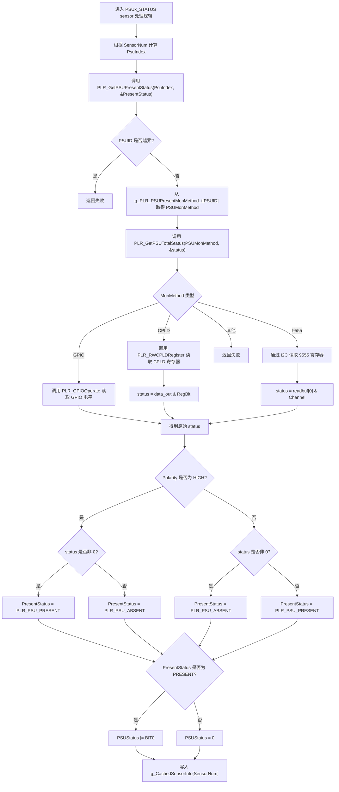
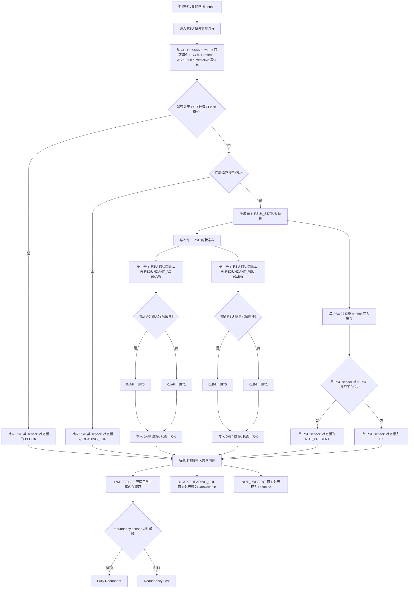
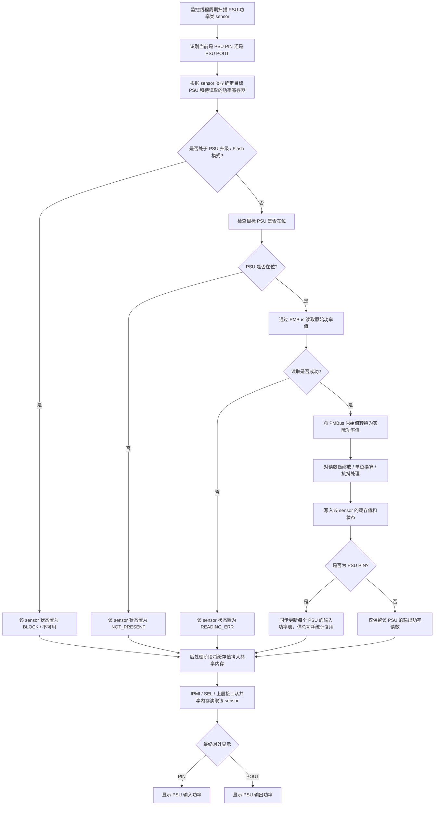

# PSU status sensor

核心函数：

- PLR_GetPSUPresentStatus (line 210) 作用：对单个 PSU 返回 PRESENT / ABSENT
- PLR_GetPSUTotalStatus (line 147) 作用：按配置从 GPIO / CPLD / 9555 真正把底层状态读出来
- PLR_PSUSensorMonitor 中 case PLR_SENSOR_PSU0_STATUS ~ PLR_SENSOR_PSU4_STATUS (line 2755) 作用：基于 Present / AC / Fault / Predictive 生成 PSU 状态位图，并写入 g_PLR_PSUStatus_t[i].IsFault

# PSU Fan speed sensor

核心函数：

- PLR_PSUSensorMonitor 中 case PLR_SENSOR_PSU0_FAN_SPEED ~ PLR_SENSOR_PSU4_FAN_SPEED (line 2126) 作用：这是 PSU 风扇转速 sensor 的主逻辑，先检查在位，再读 PMBus，再做转换和缓存
- PLR_GetPMBUSReading (line 415) 作用：真正从 PSU PMBus 寄存器读原始值
- 补一个底层转换： PLR_PMBUSConvertLinear (line 2170) 作用：把 PMBus 线性格式转换成可用读数

#  **PSU** **redundancy sensor**

核心函数：

- PLR_PSUSensorMonitor 中 case PLR_SENSOR_REDUNDANT_AC (line 2867) 作用：统计 AC_A_GoodCount / AC_B_GoodCount，得出 0xAF
- PLR_PSUSensorMonitor 中 case PLR_SENSOR_REDUNDANT_PSU (line 2905) 作用：统计 good PSU 数量，得出 0xB4

# Pin and Pout

核心函数：

- PLR_Project_SensorMonitor.c (line 2013) 这是 PIN/POUT 的主流程函数所在位置。它负责识别当前 sensor 是 PIN 还是 POUT，确定 PSU 编号，检查在位状态，读取 PMBus 值，做转换和缓存写入。
- PLR_GetPMBUSReading (line 415) 这是底层真正去 PSU 读 PIN/POUT 寄存器原始值的核心函数。
- PLR_PostMonitorSensor_PSU (line 442) 这是把前面算好的缓存值写到共享内存、让上层真正读到的核心函数。

# PSU在位逻辑




# psu fan speed

````mermaid

flowchart TD
    A["监控线程周期扫描 PSU Fan Speed sensor"] --> B["根据 sensor number 映射到对应 PSU"]
    B --> C["设置风扇转速寄存器与缩放参数"]

    C --> D{"是否处于 PSU 升级 / Flash 模式?"}
    D -- 是 --> E["状态置为 BLOCK<br/>停止本轮读取"]
    D -- 否 --> F["检查 PSU 是否在位"]

    F --> G{"PSU 是否在位?"}
    G -- 否 --> H["状态置为 NOT PRESENT<br/>停止本轮读取"]
    G -- 是 --> I["进入底层读取流程"]

    I --> J{"底层检查 AC 是否正常?"}
    J -- 否 --> K["读取失败<br/>停止本轮读取"]
    J -- 是 --> L["通过 I2C 向 PSU 发送 PMBus 风扇读取命令"]

    L --> M{"I2C / PMBus 读取是否成功?"}
    M -- 否 --> N["状态置为 READING ERROR<br/>清空防抖历史<br/>停止本轮读取"]
    M -- 是 --> O["得到 2 字节原始风扇数据"]

    O --> P["将 PMBus Linear 数据转换为实际转速值 x100"]
    P --> Q["按传感器线性模型缩放为 8-bit raw reading"]
    Q --> R["进行 anti-shake 防抖处理"]

    R --> R1{"anti-shake 返回值是否为 0xFF?"}
    R1 -- 是 --> R2["状态置为 READING ERROR<br/>停止本轮读取"]
    R1 -- 否 --> S["写入 sensor 缓存<br/>读数 / 状态 / 原始信息"]

    S --> T["Post hook 回填给 IPMI / SDR"]
    T --> U{"最终状态"}
    U -- 正常 --> V["对外显示有效读数"]
    U -- 不在位 --> W["对外显示 Disabled"]
    U -- 读取失败 --> X["对外显示 Unavailable"]
    U -- BLOCK --> X

    E --> Y["结束"]
    H --> Y
    K --> Y
    N --> Y
    R2 --> Y
    V --> Y
    W --> Y
    X --> Y
```
````


# **PSU redundancy sensor**




# Pin and Pout

