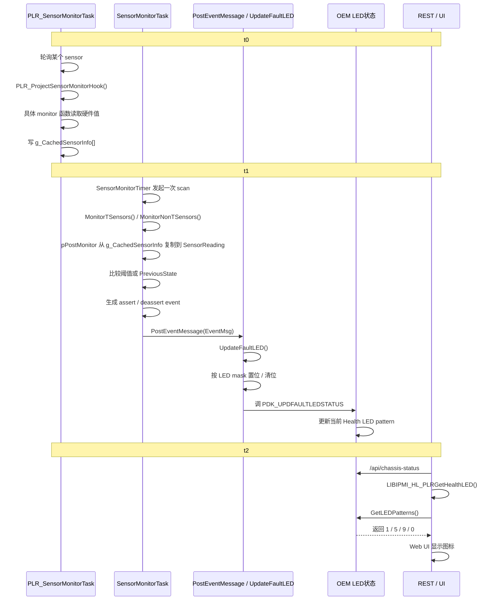

**Bug复盘**

这次问题总共花了三天。第一天主要在梳理健康灯和 SEL log 背后的代码逻辑，到晚上时发现一个关键转折：问题描述本身和实际现象对不上，复现不了。于是这次工作的目标从“修 bug”转成了“验证 bug 是否成立”，最终结论是：**这不是一个真实的软件 bug，而是问题描述、验证口径和数据理解之间存在偏差。**

从现象上看，最开始怀疑的是健康灯状态和 SEL log 不一致，或者部分电压 sensor 的事件没有按预期进入后续链路，导致 EventCount、严重度判断或者最终健康灯表现异常。这个怀疑之所以成立，是因为从表面现象看，确实像是“sensor 有告警，但后面的状态没有正确反映”。但真正往下拆后发现，问题并不在单一模块，而是在“告警链路”里多个环节的理解被混在了一起。

这次真正梳理清楚的调用链，大致是这样一条线：
硬件 ADC 读数先进入项目侧监控逻辑 PLR_Project_SensorMonitor.c 和通用监控逻辑 SensorMonitor.c，形成 ADCReading；然后经过抗抖、阈值比较，决定是否产生 assert/deassert 事件；事件进入 SEL 相关处理，在 SEL.c 和 event_log.c 这条链路里落日志、被上层读取；严重度和健康灯判断再结合 PLR_SEL_Severity_Def.h 的定义，以及当前告警/EventCount 的匹配逻辑来决定最终表现。

这次最值得记录的数据路径分析，是把“物理电压”“ADC侧分压电压”“voltage_mv”“ADCReading”“最终显示值”这几个层次彻底分开了。之前一度把表里的最终 rail 电压直接当成 ADCReading 去理解，后来结合 ADC 驱动和你给的表才确认，很多 sensor 进入代码时已经不是最终 rail 电压，而是**分压后进 ADC 的电压**。比如 PVCC3V3_AUX_CPU0 最终电压是 3.3V，但 ADC 侧是约 1.1V，所以在 /10 这条路径里，最终应该写的是 110，不是 33，也不是 330。这个认识一旦理顺，很多“为什么值看起来不对”的疑问就都解释通了。

这次排查过程中还确认了几个容易误判的点。第一，curAlarm.log 反映的是**当前激活告警**，不是完整历史 SEL；如果把它和完整 SEL 历史混为一谈，就会得出错误结论。第二，之前怀疑过 GenerateID 不匹配导致 EventCount 没加上，但实际日志里的 GenID low = 32，也就是 0x20，对应的是 BMC 生成事件，这和当前告警链路里的预期是对得上的，所以这个方向最终被排除。第三，临时测试代码里如果 fault/recovery 相位切换太快，会被 anti-shake 吃掉，因为当前抗抖窗口是 5 点平均；所以有些“看起来逻辑没生效”的情况，本质上不是产品逻辑错了，而是测试信号持续时间不够。

从根因看，这次问题最后不是代码功能性 bug，而是三个层面的偏差叠加：
一是 bug 描述本身不够准确，复现条件没有先被严格确认；二是对链路中的数据语义理解不一致，把当前告警、历史 SEL、ADC 原始值、显示电压这些概念混在了一起；三是中间为了验证而加的测试代码也经历了几轮试错，像 phase 切换、手工赋值位置、抗抖窗口这些细节如果没理解清楚，也会制造“像 bug 一样的假象”。

所以这次的“修复点”其实不是单纯改某一行产品代码，而是把验证链路修正过来：
先确认问题能否稳定复现，再分段验证 sensor 采样、阈值判断、SEL 落盘、严重度映射、健康灯表现；在 PLR_Project_SensorMonitor.c 里通过手动给 ADCReading 赋固定正常值/故障值来构造可控输入，验证链路是否真的通；并用表中的 ADC 侧电压去反推手工赋值，而不是直接拿最终显示电压硬套。最终通过这套验证，确认原始问题描述不成立，因此结论是“验证为非 bug”，而不是“修复了一个真实 bug”。

**个人成长总结**

这次最值得学习的，不是某一个函数怎么写，而是对整条架构的理解更完整了。以前更容易盯住某个点，比如健康灯没亮、SEL 不对、某个 sensor 值异常，就直接下钻代码；这次真正学到的是，要先把它放回完整链路里看：**采样从哪来，数据中间怎么变形，状态在哪一层被判断，日志在哪一层落盘，最终显示又在哪一层被解释。** 只有把链路画完整，才不会被局部现象带偏。

这次对排查思路也有很直接的提醒。第一，解 bug 的流程一定要规范，尤其是“先复现，再分析”。这次前期花了很多精力理解背后的代码原理，这本身没有错，但因为对复现条件抓得不够紧，导致一开始是在“默认 bug 存在”的前提下往下推，最后才发现连问题本身都不成立。以后遇到类似问题，第一步不应该是“怎么修”，而应该是“这个问题到底能不能稳定复现，复现条件是什么，失败标准和成功标准分别是什么”。

第二，这次也验证了一个很重要的方法：对于多种可能原因同时存在的现象，不能凭感觉选一个最像的去改，而是要把所有可能性列出来，一条一条排除。比如这次先后怀疑过 sensor 读值异常、GenID 不匹配、SEL 没落盘、当前告警和历史 SEL 混淆、测试代码节拍被抗抖吞掉等方向。真正有效的不是一开始就猜中，而是把怀疑项写下来，逐个做证据闭环。以后再遇到复杂问题，我会更主动地先写“假设清单”，再按证据推进，而不是一边想一边散着试。

第三，这次对“数据流分析”的理解进步很大。之前更容易把一个值当成“就是这个值”，现在会更自然地追问：这个值的单位是什么，它在这一层代表的是原始量、分压后的量，还是展示层的量，它是不是已经经过线性化、缩放、抗抖或者阈值映射。像这次 3.3V -> 1.1V ADC侧 -> voltage_mv -> ADCReading 这一条链，就是很典型的例子。以后碰到传感器、功耗、电压、电流这类问题，我会优先拆“物理量”和“代码里的表示量”，先把单位和层级统一，再谈逻辑。

第四，这次也暴露了工程习惯上的问题。测试代码必须建独立分支，这次直接在一份代码上反复改，导致一旦想回到上一版，就只能靠重新写，既浪费时间，也容易把临时验证逻辑和正式逻辑混在一起。以后只要涉及验证性改动，尤其是这种需要反复切换不同测试方案的场景，我会先切分支，把每次有效尝试都留痕，方便回滚和比对。

最后一点是对 AI 的认识更实际了。这次 AI 在“快速梳理可能逻辑”和“辅助生成验证思路”上确实有帮助，但也有明显边界，尤其是在单位、数据语义、代码上下文没完全吃透的时候，很容易给出看起来合理、实际不严谨的结论。比如手动赋值测试的具体位置和具体值，如果只听 AI，很容易被带偏；真正把问题坐实，还是要靠自己回到代码和数据表里做交叉验证。以后我还是会用 AI 帮我加速理解和展开假设，但不会把它当最终判断，而是把它当成一个“给方向、给备选思路”的工具。

如果要把这次的收获压缩成以后处理类似问题的做法，我会总结成四句话：
先确认问题是否真的存在，再进入修复；先画完整链路，再钻具体代码；先统一数据单位和语义，再讨论数值对不对；先列假设逐条验证，再决定改哪一层。这样做，效率未必在最开始最快，但会明显减少走弯路和误修的概率。

