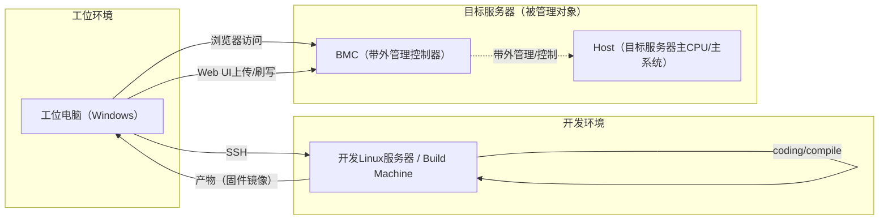

# 2026/2/26

### 开发流程图

```mermaid
flowchart LR
  subgraph Desk[工位环境]
    PC[工位电脑（Windows）]
  end

  subgraph Dev[开发环境]
    BM[开发Linux服务器 / Build Machine]
  end

  subgraph Target[目标服务器（被管理对象）]
    HOST[Host（目标服务器主CPU/主系统）]
    BMC[BMC（带外管理控制器）]
  end

  PC -- SSH --> BM
  BM -- coding/compile --> BM
  PC -- 浏览器访问 --> BMC
  BM -- 产物（固件镜像） --> PC
  PC -- Web UI上传/刷写 --> BMC

  BMC -. 带外管理/控制 .-> HOST
```

